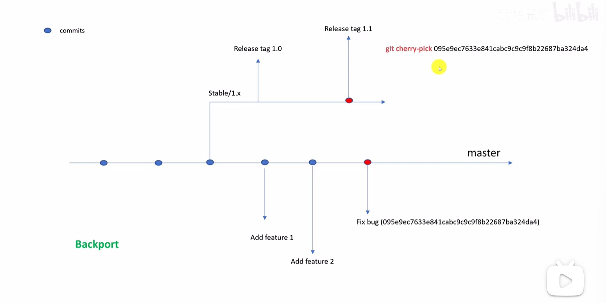

# git

**idea：**ctrl+k：commit快捷操作 ctrl+shift+k：push快捷操作

[TOC]

##### **一、git add/commit工作区等背后原理**

###### 1.1原理相关（以命令行为例）

（注：正常打开命令行也可以进行git操作，但得是windows命令，而在对应位置打开gitbash会是linux命令）

config可以进行局部配置和全局配置，配置对应的邮箱和姓名

-t文件类型 -p文件内容

git add后会在object文件里新建一串由加密算法加密过文件类型，如blob和文件内容的哈希值

tree .git可以清晰看到对应结构的变化

工作区提交给索引区，通过索引区提交给代码仓库

索引区（index）会再生成 权限码 blob对象 0，如果文件内容有更改并且没有提交到索引区会对索引区和工作区的blob对象进行对比，对比出来显示modified，如果提交了会发现在索引区出现修改前和修改后两个版本的blob

git commit里有commit和tree两种类型，tree里包含文件名和blob对象

head指向当前分支，当前分支指向当前操作

新建文件夹提交时会在原来的基础上新建一个tree对象，tree对象里面再放对应文件

**单个文件提交时的对象情况**

当提交一个文件时，会创建一个 blob 对象来存储文件内容，一个 tree 对象来记录该文件的相关信息（文件名、权限等，指向对应的 blob 对象），以及一个 commit 对象来记录这次提交的整体信息（指向这个 tree 对象和父提交） 。所以从 tree 查看时，可能看到代表文件的相关信息（文件名等），以及和 blob、commit 关联的一些 “痕迹”，如果把它们都看作是 “文件”，就会觉得有 3 个相关 “文件”。

**多个文件一次提交时的对象情况**

- blob 对象：每一个文件都会对应创建一个 blob 对象，用于存储各自的文件内容。比如提交了`file1.txt`和`file2.java`，就会分别创建两个 blob 对象来存储这两个文件的内容。
- tree 对象：会创建一个顶级的 tree 对象，它会包含多个条目，每个条目对应一个文件，记录着文件名、文件权限等信息，并指向对应的 blob 对象 。如果提交的文件中有目录结构，目录也会有对应的 tree 对象，形成嵌套的 tree 结构，就像真实文件系统的目录层级一样。
- commit 对象：和单个文件提交类似，仍然只有一个 commit 对象，它记录提交者信息、提交信息等，并且指向这个顶级的 tree 对象以及父提交 。

###### 1.2idea相关

settings->version control ->git->path to git execute找到正确存放git.exe的地方

vcs->create git repository ->找到当前项目位置（完成后会变红)

右键项目名称选择git，选择manage remotes->关联远程地址

点开左边栏的commit，将unstaged（未准备好提交）的加到staged里，然后进行commit，点上边栏的master里的push，会在远程新建一个master分支，此时会进行github仓库的登录

add的类为绿色，没有add的是红色，commit的是白色

在 Git 中，一个文件同时出现在 `staged`（暂存区）和 `unstaged`（工作区）状态，通常是因为这个文件**被修改过两次**：

1. **第一次修改后被添加到暂存区**（`staged` 状态）
	比如你新建类文件后，执行了 `git add 文件名`，此时文件进入暂存区。
2. **之后又对文件进行了第二次修改**（`unstaged` 状态）
	当你再次编辑并保存这个文件时，工作区的文件内容与暂存区的版本产生了差异，因此会同时显示在两个区域：
	- `staged` 区：保留着第一次 `git add` 时的版本
	- `unstaged` 区：显示第二次修改的内容（未暂存）

- 如果想保留最新修改并更新暂存区：再次执行 `git add 文件名`，此时 `unstaged` 状态会消失，暂存区会更新为最新版本。
- 如果想放弃工作区的修改：执行 `git checkout -- 文件名`，会用暂存区的版本覆盖工作区，`unstaged` 状态消失。

###### 1.3出现的报错

主要是idea远程连接问题

1.

解决方法： `Appearance & Behavior` -> `System Settings` -> `HTTP Proxy`选择 `No proxy`

2.无法连接远程仓库

解决方法：

```bash
140.82.113.3  github  .com
185.199.108.154 github.global.ssl.fastly.net
199.232.69.194 codeload.github.com

ipconfig /flushdns
```

3.正常网址无法打开

1️⃣打开控制面板
2️⃣网络和internet
3️⃣internet选项
4️⃣连接-局域网设置
5️⃣勾选✅自动检测设置，取消勾选☑️代理服务器
6️⃣最重要-点各种确定/应用

##### 二、分支管理

###### 2.1原理相关（以命令行为例）

分支是指向commit的有名字指针

 head可以指向当前工作分支，还可以指向当前分支最新提交点

git branch显示当前的分支

git branch dev创建新的分支dev，并刚好指向master最新提交点，git log时会看到head指向master，dev

但实际上git/ref/HEAD是指向master

git checkout dev切换分支到dev，与上述同理

git branch -D dev强制删除（不推荐），git branch --delete dev会提示信息没有同步更新，删除后仅删除指针，里面的内容还在但无法访问，是垃圾对象

HEAD通常是当前分支的最新commit的别名，是符号引用。

删除不是级联删除，仅仅只是删除了指针，里面的内容对象文件名都还在，可以通过1.git reflog找到以前的记录2.git cat-file -p 进object里一个个找

找到后可以git checkout指向这个记录，然后git checkout -b tmp创建临时分支

默认左索引（--）右工作区（++）

git diff是索引区和工作区对比，git diff --cached是索引区和代码仓库对比

##### 三、远程仓库

###### 3.1原理相关（以命令行为例）

先在gitee上创建仓库，然后git remote add origin https://gitee.com/gao-ray/git-demo.git 设置远程仓库，可以通过cat .git/config看配置成功与否，再 git push -u origin master，把代码仓库里的内容推送到origin仓库（之前设置的远程仓库别名，一般都是这个）的master分支，然后在log和ref文件夹下会产生remote，此时远程和当前的都会指向最新更新，当在当前的代码仓库进行更新后HEAD指向最新，远程保持原样

##### **四、文件压缩**

###### 4.1原理相关（以命令行为例）

ls -lh.git/objects/d7查文件大小，ls -lh查文件大小 ls -l查文件字节数，简单重复好压缩，二进制压缩后比没压缩字节数还要多一些，git add就已经压缩了（tree.git/objects看结构）

压缩后会在object生成index和pack文件，压缩后仍然可以通过之前的blob值获取相应版本，是通过index快速寻找pack文件里的，index里最大的文件是初始版本，delta是每回提交的文件数，index里每回更改的版本还会记录初始版本和改的地方，一开始克隆下来是压缩的，object只有info和pack（sha1目前已经有破解的案例，但git压缩的时候在前面加了header，所以目前还没有重复，但未来可能会改成sha256）

git help unpack-objects可以去查对应命令，解压缩不能放在git目录下，所以要把pack文件从objects移到git根目录下 mv objects/.pack  .git,然后就可以git unpack-objects ‹.git/pack进行解压缩，解压缩后的远大于压缩前的大小，压缩提高了传输的效率

git gc压缩文件

##### **五、垃圾对象回收**

###### 5.1原理相关（以命令行为例）

一般git gc会把没有指向的blob文件删除，如果没有删除的话可以git prone进行删除，git prone -n可以看一下删后的样子但不删，git fsck可以看下没有指向的blob文件，有两种情况，一种是git add提交多次修改文件但没有commit，也就不能回滚，这种可以通过git prone和git fsck进行删除，还有一种是删除了对应分支但分支下提交的文件还在，这种上述两个方法都不显示，可以通过git -c gc.reflogExpire=0 -c gc.reflogExpireUnreachable=0 \
-c gc.rerereresolved=0 -c gc.rerereunresolved=0 \
-c gc.pruneExpire=now gc "$@"进行删除，防止对硬盘空间消耗过大

还有一种是标签被删除的垃圾对象

##### 六、分支合并

###### 6.1原理相关（以命令行为例）

1.fast forward，master分支提交几次commit后又新建了一个bugfix分支，在这个分支上进行提交，要确保在新建并修改分支后master分支不变，head指针指向了bugfix分支，合并:切换到master分支并git merge bugfix，会把master分支的指针移到bugfix上，Git 会把合并前 `master` 指向的提交记录到 `ORIG_HEAD`，git merge的信息会显示从originhead转向head，git默认fast forward不靠谱要进行回滚，git reset ORIG_HEAD进行回滚，回到原来master提交的地方，另一删除的分支提交的内容放到工作区显示未跟踪

2.没有冲突的3way merge，在master和bugfix都进行过提交进行merge，git会自动生成一个commit，按wq保存退出后会进行提交，git log会显示这次commit，cat看详细展示父类是master提交和bugfix提交的


3.有冲突的3way merge，一开始看缓存区缓存文件git ls-files -s只有一个文件（版本号0)，进行git merge bugfix，会产生冲突无法生成，此时状态会是test.txt处于修改状态，此时cat test.txt能看到不同分支更改信息（git自动生成，HEAD是当前分支）,修改前看git ls-files -s发现索引里存了三个test文件(版本号123，可以通过git cat-file -p哈希值来查看具体内容)，然后code .可以进入编辑器进行更改，然后git add，git ls-files -s只有改后的文件，然后git commit，不用加信息，自动就是合并的信息，父类有master和bugfix下的最新更新，git branch -D bugfix前后没有删除文件，只是refs里heads的bugfix指针删除了

**git rebase(3way merge->fast forward)**，在dev分支上git rebase master， 要求master分支后面没有变过或者master后dev分支有master分支上最新的commit延展，git rebase后会将创建分支后的master分支上的更新给到dev分支上，并且会将dev分支已有的更新进行重写，并且sha1值会进行改变,一般不建议使用，尤其是master分支，如果push到远程仓库后进行rebase，再进行push得强制push，别人拉下来代码再提交也会报错，大家的结构不一样了，rebase一般在自己的开发分支

| **操作**     | **效果**                                                     | **时间线样子**                   |
| ------------ | ------------------------------------------------------------ | -------------------------------- |
| `git merge`  | 直接把你的修改和网上的合并，保留两个分支的历史               | 第一天 → 第三天 → 第二天（乱序） |
| `git rebase` | 把你的修改 “移动” 到网上最新内容后面，让时间线看起来像一条直线 | 第一天 → 第二天 → 第三天（整洁） |

<video id="video" controls preload="none"> <source src="images/git.MP4" type="video/mp4"> 您的浏览器不支持视频播放。 </video> 

###### 5.2idea相关

可以在下边栏切换分支查看本地和远程提交，如果有冲突会远程提交失败，在上边栏的分支里选择update，并且弹窗选择rebase或者merge，选择merge会先进行fetch，可以很方便地看到冲突，左边是当前代码，右边是远程代码，可以依据情况进行修改，修改完后会弹窗，再apply即可

此处出现报错无法连接远程仓库：设置系统代理
有时候取消代理设置仍然会出现报错，这时可以通过设置系统代理来解决。具体步骤如下：

打开系统设置，搜索代理设置，并点击编辑按钮。


在代理服务器中，将端口设置为7890（这个端口不会影响正常上网，可以放心设置），然后点击保存。


在终端输入以下命令，设置 Git 使用本地代理：

git config --global http.proxy http://127.0.0.1:7890
设置完成后，可以通过以下命令检验是否设置成功：

git config --global -l

##### 七、标签（tag）

###### 7.1原理相关


heads下是分支结构，动态指向最新commit；tags下是tag，静态指向某个commit


注意删除tag后对象仍保留，成为垃圾对象，因为sha1里包含了时间戳，所以标签内容名字一样也会新建一个tag对象

###### 7.2idea相关

在git log里的提交历史右键new tag，完成后会在本地提交中出现标签，在push的时候勾选push tags会把tag一并上传到远程仓库中，并且能根据对应tag下载历史代码，也就是到当前 tag 为止的全部代码（注意不是两个 tag 之间的差异）（可以把 Git 的 tag 理解成 “给某一时刻的代码拍了张照片”。从 tag 下载代码，就是拿回 “这张照片拍摄时的完整代码”，和 “有没有前一个 tag” 没关系，只和 “这张照片对应的提交（拍摄时刻）” 有关。）

##### 八、本地分支和远程分支

###### 8.1原理相关（以命令行为例）

git branch只能查看本地分支，加-r能查看远程分支，加-a能看到本地和远程分支

git remote -v基本信息  git remote show origin后出现 master tracked说明本地和远程相关联

查看结构会发现remote目录下只有head没有master，是在pack压缩里，git log看到的origin->master是存储在本地的信息

（Git 的引用（包括远程分支）有两种存储方式

- **松散引用**：以单独文件形式存在于 `.git/refs/` 目录下（比如 `.git/refs/remotes/origin/master`），直接存储 commit 哈希值。
- **打包引用**：当引用数量较多或长期未更新时，Git 会把它们压缩到 `.git/packed-refs` 文件中（类似 “打包存档”），此时 `.git/refs/` 目录下对应的松散文件会被删除（但引用依然有效）。（可以通过git pack-refs --all实现从松散引用到打包引用）

）

fetch可以将远程仓库上的更新合并到本地，也可以将本地仓库的更新上传到远程

git fetch后git log不显示远程仓库更新

 **核心原因：`git log` 默认只显示当前分支的历史**

- **`git fetch` 的作用**：从远程仓库下载更新，并将其存储在本地的远程分支（如 `origin/main`）中，但**不会自动合并到当前分支**。
- **`git log` 的默认行为**：仅显示当前分支（如 `main`）的提交历史，而不包括远程分支（如 `origin/main`）的历史。

git log origin/master可以看到远程仓库的更新日志

压缩的ref会滞后，而remotes下的master是最新的

**远程新增的分支，本地能通过 fetch 获取（无变有）；但远程已删除的分支，本地不会自动消失（有不能变无），需要手动用`git fetch --prune`清理**

远程是远程，本地是本地，本地的远程是本地的远程，fetch只是保证远程和本地的远程同步，并不会改变本地，要保证本地最新，要merge本地远程到本地（也就是**git pull**）

| **场景**                           | **`git fetch` 的作用**                   | **需要额外操作吗？**                    |
| ---------------------------------- | ---------------------------------------- | --------------------------------------- |
| 关联前新建的分支                   | 无法获取网上内容，因为没关联             | 先关联远程仓库（`git remote add`）      |
| 关联后新建同名分支（自动跟踪）     | 获取网上同名分支的最新内容，但不更新本地 | 需手动 `git merge` 合并更新             |
| 关联后新建网上没有的分支（未跟踪） | 忽略该分支，只更新已跟踪的分支           | 需先 `git push -u` 推送到网上并设置跟踪 |

git branch -vv：1.**检查同步状态**2.**确认跟踪关系**3.**避免搞错分支**

如果不确定或者会有冲突，先进行git fetch，然后git diff origin/master,如果没问题就直接git pull

**`FETCH_HEAD` 会记录最近一次 `git fetch` 拉取的远程分支信息，且当前所在分支对应的远程分支会排在第一行，方便后续操作（如 `git merge` 时默认合并这个最新的远程分支）；如果没执行过 `git fetch`，这个文件会保持上次 fetch 后的内容顺序**。

远程新建的分支不会自动出现在本地分支列表里，需要用`git checkout 远程分支名`来创建本地对应分支并关联，之后才能在`git branch -vv`中看到这个分支及其关联信息

`git pull`的核心是 “拉取并合并”，实际过程是先执行`git fetch`（从远程仓库下载最新内容到本地，以压缩的对象形式传输），本地将这些新数据与本地分支对比，确定需要合并的内容，再执行`git merge`（将下载的远程分支内容合并到当前本地分支）。

**git push**:

1. **新建本地分支推送到远程的步骤**：
	当在本地新建`feature-1`分支后，由于远程仓库还没有这个分支，直接`git push`会失败（因为没有可关联的远程分支）。
	- 第一步需用`git push origin feature-1`：在远程仓库创建同名的`feature-1`分支，并将本地分支内容上传，但此时本地与远程分支尚未建立 “跟踪关系”（即本地分支不知道自己对应哪个远程分支）。
	- 第二步需用`git push -u origin feature-1`：`-u`（即`--set-upstream`）的作用是在推送的同时，让本地`feature-1`与远程`origin/feature-1`建立跟踪关系。之后再执行`git push`时，无需指定远程和分支名，Git 会自动推送到关联的远程分支。
2. **删除远程分支的方法**：
	用`git push origin -d feature-1`可以删除远程仓库的`feature-1`分支（`-d`是`--delete`的简写）。
3. **取消本地分支对远程的跟踪**：
	如果想保留本地`feature-1`分支，但不再让它与远程分支关联（比如远程分支已删除，或不想再同步），可以用`git branch --unset-upstream feature-1`，这样本地分支就会解除对远程分支的跟踪关系。

**基于远程分支创建的本地分支，会自动关联；本地凭空新建的分支，推送到远程后也不会自动关联，必须手动设置。**

##### 九、hook


通过使用 Git Hooks，我们可以在这些事件发生前或发生后执行特定的操作，比如自动化测试、代码风格检查、部署到服务器等

code .会打开vscode，从里面s的设置找到exclude，把.git勾掉就能显示hook，把hook里的文件删掉后面的sample就会生效（**`exit 0`**：表示钩子执行成功，Git 会**继续执行后续操作**（如提交、推送）**`exit 1`**（或任何非零值）：表示钩子执行失败，Git 会**立即终止当前操作**（如提交被拒绝））

**hook不会推送到远程仓库（git默认hook的任何修改都不会推送）**

如何通过远程仓库共享脚本配置，让团队成员克隆仓库后提交代码时自动触发 Git Hook 审查。核心思路是：**将钩子配置文件和生成脚本上传到远程仓库，成员拉取后执行生成脚本，在本地生成钩子文件，从而实现提交时的自动审查**。

1.Python 方案：通过 `requirements.txt` 和生成脚本共享 Hook 配置

```git
 python --version
 rm -rf venv  # 即使没有 venv 文件夹，执行这个也没事
 python -m venv venv
（ls后会出现/venv）
 source venv/Scripts/activate
 pip install -r requirements.txt
pre-commit install

```

 `requirements.txt`锁定工具版本，团队所有人用一模一样的环境

`.pre-commit-config.yaml`中更换了当前的最新版本位置

2.Java 方案：**Git 钩子机制与 Shell 脚本结合**

一开始想找现成的 “高级工具”（Checkstyle/PMD）来做，这些工具功能强，但太复杂：要下载各种配置文件，联网找依赖，而且管得太宽（连空行、注释格式都要管），结果一堆报错搞不定。

后来换了个思路：我们真正要拦的只有 “类名没大写” 这一件事。于是直接写了个简单脚本，用系统自带的 “搜索工具”（grep）在提交代码前扫一遍，发现类名小写就不让提交，其他格式问题暂时不管。

| Python 方案                  | Java 方案                               | 作用相同点                         |
| ---------------------------- | --------------------------------------- | ---------------------------------- |
| `.pre-commit-config.yaml`    | 检查工具配置文件（如 `checkstyle.xml`） | 定义代码检查规则                   |
| `black`/`flake8` 工具        | `Checkstyle`/`PMD` 等 Java 静态检查工具 | 执行代码风格、语法错误检查         |
| Git 钩子脚本（`pre-commit`） | Git 钩子脚本（`pre-commit`）            | 提交前自动触发检查，失败则阻止提交 |

**1. 替换 `.git/hooks/pre-commit` 脚本**

```bash
#!/bin/sh
echo "🔍 仅检查类名是否以大写字母开头..."

# 用grep匹配"public class 小写字母"的错误情况
# 忽略空行、Javadoc等无关规则，只拦截类名错误
if grep -r -qE 'public\s+class\s+[a-z]' src/main/java --include="*.java"; then
    echo "❌ 发现类名错误（必须以大写字母开头）："
    grep -r -nE 'public\s+class\s+[a-z]' src/main/java --include="*.java"
    exit 1 # 阻止提交
else
    echo "✅ 类名检查通过，允许提交"
    exit 0 # 允许提交
fi
```

**2. 赋予执行权限**

```bash
chmod +x .git/hooks/pre-commit
```

**3.专门新建hook文件夹推送到远程仓库**

**4.他人拉取仓库后将hook文件夹内的内容放到git/hook目录下**，需要对复制过去的 `pre-commit` 脚本**重新赋予执行权限**，即再次运行：

```bash
chmod +x .git/hooks/pre-commit
```

#### 十、git submodule

###### 10.1原理相关（以命令行为例）

需要依赖另一软件包/库会使用（一般很少使用，因为可以用包管理直接下载）

git submodule add https://github.com/xx/git-submodule(这里可以替换)

在提交时会把git-submodule这个文件夹当成文件对待，因为我们在git-test里不会修改子模块，需要在git-module仓库里进行修改

在提交后git-test里会显示@一串哈希，这串哈希数字是子模块最新更新的哈希

**子模块的内容不会随主仓库自动克隆，首次克隆或重新克隆后，必须手动执行子模块相关命令才能获取其内容。**。

最开始初始化子模块git-submodule里面会有文件内容，删除后再克隆git-test里面没有，需要通过 

git submodule update –init –recursive进行初次拉取，根据主仓库当前记录的子模块版本，拉取对应版本的内容，让子模块目录恢复完整。

`git submodule update --recursive`将子模块更新到 **父仓库当前记录的版本**，忽略子模块自身远程仓库的最新版本，

git submodule update –remote主动将子模块升级到其远程最新版，并让主仓库记录这个新版本

- 它会直接去子模块自己的远程仓库（比如`git-submodule`的`origin`）拉取最新版本（而非主仓库记录的旧版本）。
- 拉取后，子模块目录会显示 “modified”（因为内容与主仓库记录的版本不一致了）。
- 此时需要在主仓库中执行`git add`（添加子模块的新版本引用）和`git push`，主仓库就会更新对子模块的版本记录，保存子模块的最新状态。

tree -a .可以看到包括.git/仓库的所有内容

#### 十一、git worktree

###### 11.1原理相关（以命令行为例）

如果在一个分支没有做完想要转到另一个分支，需要在该分支提交后在转到另一个分支，不然文件内容会带到另一个分支，git stash是暂时存起来不提交，git stash pop可以恢复继续进行操作

git worktree add../awx-ansible--demo-master master将原来master和dev分支的文件夹中拎出来master分支作为新的文件夹，之后就是git worktree list 可以看到awx-ansible-demo-master （master）和awx-ansible-demo（dev），然后git worktree remove awx-ansible-demo-master可以删除

git worktree可以同时使用多个分支，放到子模块下可以共享一份包依赖，是真正的平行宇宙

#### 十二、git cherrypick

###### 12.1原理相关（以命令行为例）

在一个分支上改了bug，然后发现另一分支也存在相同的bug，可以将修改了的分支的内容直接迁移到另一分支：1.先切换到未修改的分支2.git cherrypick，修复后虽然commit的哈希值不同，但commit的名称和内容都相同3.应用完  git cherry - pick  进行bug修复后，通常会打上新的版本标签（如  Release tag 1.1  ），表示这个分支上有了新的稳定版本可以发布。



这个提交应用了  master  分支上  Fix bug  提交中对文件的相同修改。由于它只关注特定提交的修改，不会把  master  分支上在  Fix bug  提交之后其他特性相关的提交合并过来，所以就实现了只将bug修复应用到  Stable/1.x  分支，而不包含其他特性。

###### 12.2idea相关

`cherry-pick` 本质是**复制 “某一次提交的变更” 到当前分支**，切换到要进行修改的分支，选择要进行cherry pick的另一分支下的提交（最好不要提交混乱，修改的部分一个分支有一个分支没有或者代码冲突，有些还需要进行pull），cherrypick后会自动放入暂存区(可能还需要merge)，可在后续进行提交，另外还可以在git log中选择类似小眼睛的选项，选择not cherrypicked commit可以看到有进行cherry pick的是灰色的

#### **十三、git patch**

###### 13.1原理相关（以命令行为例）

git format-patch -1（最后一次commit生成的patch）

patch开头是邮件开头，包括作者、日期、主题，主体是设置的commit，最后是git的version

切换分支后再git apply 'patch的绝对文件路径'

这时文件内容做了修改但没有提交，要再add和commit,这时apply才算完成

**git sendemail**


git sendemail 'patch的绝对文件路径'，在填写要发送的邮箱，不填邮件id，再选择yes，填相应密码,然后邮箱就会收到邮件名为patch的邮件，里面会有body，diff和version

-  git cherry - pick  操作对象是提交（commit），通过指定提交哈希值，把对应提交的修改应用到当前分支， 并生成新的提交。
-  git patch  围绕补丁文件工作，先用 git diff 生成记录代码差异的补丁文件，再用 git apply 应用补丁来引入变更。

###### 13.2idea相关

git里有两种打包patch的方式：1.（改动但不进行物理上的创建删除）在改动的类上右键选择local history再show history再在选中的历史点添加create patch，然后对原有改动的类进行rollback，再在最上面点击git里的patch进行apply patch，最后可以恢复原有修改

2.有进行物理上的创建删除，由于没有对应的基线，所以local history不足以支持恢复，可以将改动commit生成git log里的历史再右键create patch，这样可以恢复新建或者删除某一个类

#### 十四、git config

配置有三个级别，优先级从高到低分别是仓库级别（local，存储库的.git/config）、用户级别（global用户主目录的.git/config，即‪C:\Users\YourUserName.gitconfig）、系统级别（system powershell里 git config --system --list --show-origin查看）

git多用户之间的切换(防止git log里泄露工作邮箱)：

方案一：修改当前仓库的config（vim .git/config),加上user部分

[core]
        repositoryformatversion = 0
        filemode = false
        bare = false
        logallrefupdates = true
        symlinks = false
        ignorecase = true
[user]
        name = demo
        email = demo@demo.com

方案二：1.先创建work和personal两个文件夹，确保工作在work，私人在personal

2.然后在personal文件夹下

vim ~/.my-gitconfig

[user]

​			name=姓名

​			email=私人邮箱

vim ~/.gitconfig

[user]

​			name=姓名

​			email=公司邮箱

[includeif “gitdie:~/project/personal/”]

​			path=~/.my-gitconfig

#### 十五、git alias

###### 15.1命令行操作

git log --oneline --graph --all看所有分支的简短的提交情况

简化一： alias gitlog="git log --oneline --graph --all"   然后使用gitlog

简化二：git config --global alias.lg "log --oneline --graph --all"     然后使用git lg

多次修改同一处地方想最后想只保留一处：git add .   git commit --amend --no-edit,如果push后仍有这个效果就git push origin master --force覆盖前一次提交

简化操作：

 vim ~/.gitconfig

[alias]
        lg = log --oneline --graph --all
        cp = !sh -c 'git add . && git commit --amend --no-edit && git push origin $(git rev-parse --abbrev-ref HEAD) --force' -

git cp3

#### 十六、git的回滚和强推和代码找回

######  16.1原理相关（以idea为例）

- **红色**：未纳入版本控制的新文件（未执行 `git add`）。
- **蓝色**：已执行 `git add` 但未 `commit` 的暂存文件（提交后又进行文件idea修改但未提交或执行过 `git add` 后又做了新修改）。
- **绿色**：已 `commit` 且无修改的文件（正常状态）。


| 场景                                 | 是否勾选 “删除添加文件的本地拷贝” | 最终效果                                     |
| ------------------------------------ | --------------------------------- | -------------------------------------------- |
| 新增文件，只想取消暂存（还想编辑）   | 不勾                              | 文件回工作区，内容保留，能继续改             |
| 新增文件，想彻底删内容（不要了）     | 勾                                | 文件变空白（再回滚一次就彻底删文件）         |
| 已提交文件，想撤销本次修改           | 勾                                | 文件恢复到上一次提交的状态，修改全消失       |
| 已提交文件，只想取消暂存（改完再提） | 不勾                              | 文件回工作区，修改内容保留，改完再 `git add` |

undo commit只适用于最后一次的提交，本质是 `git reset --soft HEAD~1`，功能是 “撤销上一次提交，将修改放回暂存区”。由于只针对最近一次提交，无需选择目标，所以直接执行，看起来像 “直接删了提交记录”（实际是提交记录被移除，修改保留在暂存区）。

在git中的某次提交可以右键git revision‘’能够直接跳转到此次提交，要新建分支后再在该提交的基础上更新内容，或者在更新内容并提交后直接右键该次提交新建branch，这样可以防止游离提交消失，还可以对两个分支的最新提交进行undo commit（也就是说解决 “在旧提交上改代码怕丢” 的问题：要么 “先建分支再改”，要么 “改完提交后立刻建分支”，避免游离提交消失；）

drop commit没有记录，revert commit会留下一个回滚记录（用的不多）。**“drop commits”（复数）不可点击**：通常是因为选中了多个提交，或当前提交处于无法直接删除的位置（如已推送到远程的提交、分支起点提交等），工具限制了批量删除操作。**“drop commit”（单数）可点击**：本质是通过 rebase 移除

reset可以帮助回滚从某一点开始的一系列代码

soft:在选定提交之后所做的所有更改都在暂存区，commit的内容都会保留，其新增文件+文件变更都在暂存区

mixed：commit的内容都会保留，新增文件在工作区，文件变更在暂存区

hard：commit的内容+暂存区的内容全部被丢弃

keep：commit部分内容被丢弃，未commit部分保留

代码提交远程后想撤回：先对本地进行soft回滚（回滚到要删除提交的前一次提交），再进行修改提交，不进行合并修改，在下拉框中找到force push强制提交，但要注意这期间不能有别人的代码提交

代码找回：找到对应的类右键选择git上面的local history，再选择对应记录右键revert找回

#### 十七、pull request

###### 17.1原理相关（以命令行为例）

`git push` 直接操作远程分支，`pull request `是 “合并分支” 的流程

**`git push` 的本质**：**将本地分支的代码直接同步到远程仓库的对应分支**

**`pull request` 的本质**：**远程仓库的 A 分支” 合并到 “远程仓库的 B 分支**（比如把 `feature/new-feature` 合并到 `main`）

1. **“PR 是源分支向目标分支提交合并申请”**
	这是 PR 的本质 ——PR 本身不是 “传输代码”，而是 “请求将已存在于远程的源分支代码，合并到目标分支” 的协作凭证，核心是 “申请合并” 而非 “推送代码”。
2. **“PR 未合并时，后续 commit 会自动同步到该 PR”**
	只要源分支没被删除，在该分支上继续提交并 `git push` 后，PR 会自动拉取最新的 commit（无需重新创建 PR），这是多人协作中 “迭代修改代码” 的常用方式（比如根据审核意见修改后，直接推送到原分支即可更新 PR）。
3. **“PR 已合并后，需新开 PR 补充修改”**
	PR 合并后，其生命周期结束，原源分支与目标分支的关联终止。即使对同一功能补充修改，也需要基于目标分支创建新分支，再开新 PR—— 这能保证每次修改都有独立的审核记录，避免历史混乱。
4. **“仓库 PR 多但分支少的两大原因”**
	- 原因 1：未合并的 PR 可通过原分支持续更新，无需新建分支（一个分支对应一个 PR，迭代修改不新增分支）；
	- 原因 2：PR 合并后，仓库管理者会删除临时源分支（仅保留 `main`/`develop` 等核心分支），避免分支泛滥。

**PR 合并后，源分支的状态本身不会强制要求必须 “保持不变”，但从协作规范角度，通常会将其与目标分支同步（或直接删除），避免后续误提交导致的混乱**。规范的做法是：

- **选项 1：直接删除源分支**（最推荐）
	PR 合并后，该分支的使命已完成，直接在 GitHub 上删除（合并 PR 时会有 “Delete branch” 选项），后续就不会误提交到该分支了。

- **选项 2：若需保留分支，将其重置到与目标分支同步**
	如果因为特殊原因需要保留分支（比如记录历史），可执行：

	```bash
	# 切换到已合并的源分支
	git checkout feature/old
	
	# 拉取目标分支（如 main）的最新代码
	git fetch origin main
	
	# 将源分支重置到与目标分支完全一致（清除新提交）
	git reset --hard origin/main
	
	# 强制推送到远程，覆盖分支历史（仅在自己的私有分支上操作）
	git push -f origin feature/old
	```

	这样源分支就和目标分支完全同步，后续即使在上面提交，也是基于最新的目标分支，不会包含冗余历史。

###### 17.2idea相关（实际是在idea中用命令行进行操作）

1.克隆仓库并进入（若本地没有仓库副本）：

```bash
git clone git@github.com:your_username/repo_name.git

cd repo_name
```

2.创建并切换到新分支

```bash
git checkout -b feature/new-feature
```

3.进行git add和git commit

```bash
git remote set-url origin git@github.com:（提速）
git remote -v（查询是否是ssh协议格式）

git push origin 你的分支名  # 例如 git push origin feature/new-feature
```

4.在网页上创建pr

推送成功后，终端会显示类似 `https://github.com/pull/new/feature/new-feature` 的链接，直接复制到浏览器打开，在 GitHub 网页上创建 PR，填写标题和描述，再点击create pull request即可完成创建

